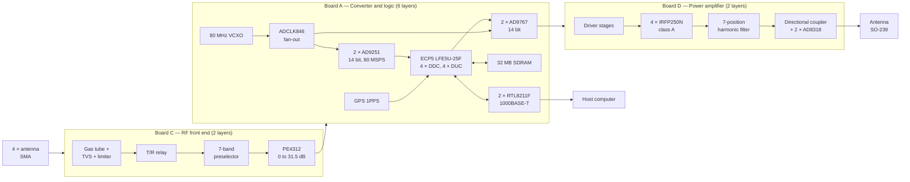

# Direct-Sampling SDR Transceiver — Data Sheet

**Preliminary. No board is manufactured. Every number in this document has a
source label. Read the label before you use the number.**

Document revision A, 16 August 2026.
Project `dogrudan-sdr`, amateur radio club of TEVİTÖL, station callsign YM2X.

---

## 1. Description

The unit is a four-channel phase-coherent direct-sampling transceiver for
amateur radio. It has no mixer and no intermediate frequency. The antenna
feeds a band-pass preselector. A 14-bit analog-to-digital converter (ADC)
then samples the radio-frequency (RF) signal at 80 MSPS. The field
programmable gate array (FPGA) does all down-conversion and filtering.

Four receive channels keep a constant phase relation. This lets the user do
adaptive noise cancellation, direction finding and beam forming. A host
computer controls the unit through gigabit Ethernet.

The unit has three printed circuit boards. Board A holds the converters, the
clock, the FPGA and the Ethernet interface. Board C holds the protection, the
transmit/receive switch and the preselector. Board D holds the power
amplifier (PA).

### 1.1 Key features

| Feature | Value | Source |
|---|---|---|
| Receive coverage | 1 MHz to 500 MHz | design |
| Receive channels | 4, phase-coherent | design |
| Transmit coverage | 1.8 MHz to 30 MHz | design |
| Transmit channels | 4, phase-coherent with receive | design |
| Transmit power | 5 W to 100 W, class A | TARGET — not verified |
| ADC | 2 × AD9251, dual 14-bit, 80 MSPS | datasheet |
| DAC | 2 × AD9767, dual 14-bit | datasheet |
| FPGA | Lattice ECP5 LFE5U-25F, BGA-256 | datasheet |
| Reference clock | 80.000 MHz VCXO, GPS-disciplined | datasheet |
| Host interface | 2 × 1000BASE-T | design |
| Burst memory | 32 MB SDRAM | datasheet |

---

## 2. Absolute maximum ratings

Do not exceed these limits. The unit can fail permanently above them.

| Parameter | Symbol | Min | Max | Unit | Source |
|---|---|---|---|---|---|
| Logic supply, board A input | VIN_PROT | −0.3 | 20 | V | TPS62130 datasheet (SLVSBC3F), Table 7.1 |
| PA supply, board D input | VIN50 | −65 | 65 | V | LM74700-Q1 datasheet |
| PA supply, protected rail | +50V | 0 | 54 | V | SMBJ54A stand-off voltage |
| ADC analog supply | +1V8_A | 0 | 2.0 | V | AD9251 datasheet, Table 3 |
| ADC digital supply | +1V8_D | 0 | 2.0 | V | AD9251 datasheet, Table 3 |
| DAC analog supply | +3V3_A | −0.3 | 6.5 | V | AD9767 datasheet (Rev. C), Table 4 |
| RF input, receive port | — | — | +10 | dBm | TARGET — not verified |
| Detector RF input | — | — | +12 | dBm | AD8318 datasheet (Rev. B), Table 2, single-ended re 50 Ω |
| Operating temperature | TA | −40 | +85 | °C | industrial-grade parts, for example RTL8211FI-CG |

**Warning.** The 1.8 V rails feed the ADC. The ADC absolute maximum is 2.0 V.
A wrong regulator part number destroys both ADCs at the first power-up. The
tool `kicad/regulator_denetim.py` checks each part number against its output
rail.

---

## 3. Recommended operating conditions

| Parameter | Min | Typical | Max | Unit | Source |
|---|---|---|---|---|---|
| Logic supply (board A, XT60) | 9 | 12 | 17 | V | TPS62130 datasheet, Table 7.3 |
| Logic supply current | — | 230 | — | mA at 12 V | calculated, 2.8 W budget |
| PA supply (board D, terminal) | 45 | 50 | 54 | V | design |
| PA supply current at 100 W | — | 6.7 | — | A | calculated, class A |
| Antenna impedance | — | 50 | — | Ω | design |
| Host link | — | 1000BASE-T | — | — | design |

---

## 4. Electrical characteristics

Each row shows where the number comes from. Rows marked "TARGET — not
verified" have no measurement and no simulation. They are design goals.

### 4.1 Receive path

| Parameter | Value | Source |
|---|---|---|
| Sample rate | 80.000 MSPS | datasheet, ABLNO-V VCXO |
| ADC resolution | 14 bit | datasheet, AD9251 |
| Instantaneous bandwidth per channel | 40 MHz (first Nyquist zone) | calculated |
| Output sample rate to host | 1.25 MSPS per channel | design, `ddc_kanal.v` |
| Decimation range (CIC) | R = 1 to 2048 | design, `cic_azalt.v` |
| Sample word to host | 24 bit signed, I and Q | design, `paketleyici.v` |
| Preselector insertion loss | 0.52 dB to 1.72 dB | simulated (ngspice), `filtre_tasarim.py` |
| Preselector band-edge loss | 0.97 dB to 2.37 dB | simulated (ngspice), `filtre_tasarim.py` |
| Step attenuator range | 0 dB to 31.5 dB, 0.5 dB step | datasheet, PE4312 |
| Chain loss, antenna to ADC pin | 2.2 dB to 8.2 dB | simulated (ngspice), `zincir_sim.py` |
| In-band flatness | 0.01 dB to 1.72 dB | simulated (ngspice), `zincir_sim.py` |
| Alias rejection | 53 dB to 124 dB | simulated (ngspice), `zincir_sim.py` |
| Antenna power for ADC full scale | +3.0 dBm to +12.8 dBm | calculated from chain loss |
| Noise figure | — | TARGET — not verified |
| Dynamic range | — | TARGET — not verified |

**Alias rejection.** The ADC samples at 80 MSPS. Nyquist is 40 MHz. Any
signal above 40 MHz folds onto the band as `|f − 80|`. After the fold,
the receiver cannot tell it from the wanted signal. Digital processing
cannot remove it.

The preselector is the only protection. Two bands needed a transmission
zero to meet the 40 dB requirement:

- On 15 m to 10 m, a signal at 50.3 MHz folds onto 29.7 MHz. That
  frequency is inside the 6 m band. A capacitor across the series
  inductor gives a zero above the band. Rejection went from 24 dB to
  55 dB.
- On 6 m, a signal at 30.0 MHz folds onto 50.0 MHz. A series-arm trap
  cannot help, because it always puts the zero above the passband. A
  capacitor in series with the shunt inductor gives a zero below the
  band. Rejection went from 36 dB to 68 dB.

Inductor Q is not one number. The suppliers give Q at different
frequencies, and some give none. The chain is therefore simulated at
Q = 25, 40 and 60. All six bands meet the requirement at all three
values. Only 160 m is sensitive: the loss goes from 6.0 dB to 11.8 dB.
At 160 m the atmospheric noise sets the noise floor, so the effect is
not measurable.

### 4.2 Clock

| Parameter | Value | Source |
|---|---|---|
| VCXO frequency | 80.000 MHz | datasheet, ABLNO-V |
| VCXO jitter | 90.3 fs at 50 MHz | datasheet, ABLNO-V |
| Clock buffer additive jitter | 54 fs narrowband, 150 fs broadband | datasheet, ADCLK846 |
| SNR limit at 30 MHz, 81 fs | 96 dB | calculated |
| SNR limit at 500 MHz, 81 fs | 72 dB | calculated |
| Reference input | 10 MHz, SMA | design |

The clock jitter sets the signal-to-noise ratio (SNR) ceiling. The formula is
`SNR = −20·log₁₀(2π·f·t_jitter)`. Below 50 MHz the ADC noise floor is the
limit. Above 100 MHz the clock jitter becomes the limit.

### 4.3 Transmit path

| Parameter | Value | Source |
|---|---|---|
| DAC resolution | 14 bit | datasheet, AD9767 |
| DAC write clock | 80 MHz | design |
| DAC update rate, 4-channel mode | 40 MSPS per channel | measured, `dac_cogullu.v` |
| DAC update rate, 2-channel mode | 80 MSPS per channel | design |
| Reconstruction filter | none — see 4.3.1 | simulated, `tx_zincir_sim.py` |
| PA class | A, all stages | design |
| PA output power | 100 W | TARGET — not verified |
| PA supply current at 100 W | 6.7 A at 50 V | calculated |
| PA dissipation at 100 W | 233 W | calculated |
| Final device | 4 × IRFP250N | datasheet |
| Reverse-polarity switch loss | 0.17 W at 6.67 A | calculated, LM74700-Q1 + IRFB4110 |
| Harmonic suppression, 2nd | 58.7 dB to 83.7 dB | simulated (ngspice), `lpf_sim.py` |
| Harmonic suppression, 3rd | 76.3 dB to 98.8 dB | simulated (ngspice), `lpf_sim.py` |
| Output filter insertion loss | 0.45 dB to 1.44 dB | simulated (ngspice), `lpf_sim.py` |
| Intermodulation distortion | — | TARGET — not verified |
| Efficiency | — | TARGET — not verified |

#### 4.3.1 Transmit envelope

The unit has no reconstruction filter. The DAC output goes to a
transformer and then to board D. The harmonic filter on board D is the
only filter in the transmit path.

A sampling DAC does not make one frequency. It makes the wanted
frequency and also images at `|k·fs ± fd|`. The zero-order hold gives
each image a different level. The relation is
`|H(f)| = |sin(πf/fs) / (πf/fs)|`.

This function falls slowly. If the carrier is near Nyquist, the
hold attenuates the carrier. An image at a lower frequency can then be
stronger than the carrier.

Simulation gives these limits. Use the unit only inside this envelope.

| Band | 4-channel mode (40 MSPS) | 2-channel mode (80 MSPS) |
|---|---|---|
| 160 m | yes | yes |
| 80 m | yes | yes |
| 60 m | yes | yes |
| 40 m, 30 m | yes | yes |
| 20 m, 17 m | **no** | yes |
| 15 m, 12 m, 10 m | **no** | yes |
| 6 m | **no** | **no** |

The reasons are these:

- In 4-channel mode on 20 m, the carrier is 18.2 MHz and the first
  image is 21.8 MHz. The ratio is 1.2. A filter cannot separate them.
- In 4-channel mode on 10 m, the carrier is above Nyquist. The carrier
  is itself an image. The fundamental at 10.3 MHz is 10 dB stronger.
- On 6 m, the same problem occurs in both modes. At 80 MSPS the band
  is still above Nyquist. The fundamental at 26 MHz to 30 MHz is 7 dB
  stronger than the carrier.

Receive works on all bands, 6 m included. Section 4.1 gives the
alias rejection. The limit applies only to transmit.

To transmit on 6 m, use an external transverter.

### 4.4 Gateware

| Parameter | Value | Source |
|---|---|---|
| Logic cells used | 11507 / 24288 (47 %) | measured (nextpnr), `sentez/pnr.log` |
| Flip-flops used | 11113 / 24288 (45 %) | measured (nextpnr) |
| Multipliers used | 22 / 28 (78 %) | measured (nextpnr) |
| Block RAM used | 12 / 56 (21 %) | measured (nextpnr) |
| Input/output pins used | 121 / 197 (61 %) | measured (nextpnr) |
| `clk_sys` maximum frequency | 87.54 MHz (target 80.00 MHz) | measured (nextpnr) |
| `clk_eth` maximum frequency | 129.15 MHz (target 125.00 MHz) | measured (nextpnr) |
| ADC capture clock margin | 150.56 MHz and 145.03 MHz | measured (nextpnr) |

The multiplier use is 78 %. This is the tightest resource. A fifth receive
channel does not fit in this device.

---

## 5. Block diagram



---

## 6. Board descriptions

### 6.1 Board A — converter and logic

Board A is the centre of the unit. It has 6 copper layers and 297 placed
footprints. The outline is 235.1 mm × 225.1 mm. The BOM has 290 components
in 79 lines. The rest are mounting holes, fiducials and test points.

The board holds these functions:

- Two AD9251 dual ADCs give four receive channels.
- Two AD9767 dual DACs give four transmit channels.
- One ECP5 LFE5U-25F FPGA does all signal processing.
- One 80 MHz VCXO and one ADCLK846 buffer make the clock.
- Two RTL8211F PHYs give two gigabit Ethernet ports.
- One 32 MB SDRAM holds burst captures.
- One power tree makes all rails from a 9 V to 17 V input.

The 6-layer stack is necessary. The FPGA is a 256-ball BGA with 0.8 mm pitch.
Escape routing from the inner ball rows needs more than two signal layers.

### 6.2 Board C — RF front end

Board C has 2 copper layers and 406 placed footprints. The BOM has 392
components in 59 lines. The outline is 350.1 mm × 235.1 mm. It is the largest board because the preselector has
4 channels × 7 band positions.

Each channel has this chain:

1. A gas discharge tube and a TVS diode protect the input.
2. A non-latching relay (G6K-2F-Y) selects transmit or receive.
3. A 7-position band filter bank selects the band.
4. A PE4312 step attenuator sets the level.

The filters are ladder band-pass sections with three resonators. All
inductors are surface-mount parts. Board C carries no wound magnetics.

The filter relays are latching (G6KU-2F-Y). A latching relay holds its
position with no coil current. This saves 1.44 W, which is half of the
board A power budget. The transmit/receive relay is not latching, on
purpose: it must fall back to receive when the power fails.

The seventh relay position is a through path with no filter. It is the
default state, and it gives wideband coverage for VHF and UHF
undersampling.

### 6.3 Board D — power amplifier

Board D has 2 copper layers and 265 placed footprints. The BOM has 243
components in 109 lines. The outline is 275.1 mm × 185.1 mm.

The amplifier is class A in every stage. Class A gives the lowest
intermodulation distortion but the worst efficiency. At 100 W output the
board dissipates about 233 W. The final stage uses four IRFP250N devices in
parallel. Four devices are necessary for the heat, not for the current.

The output filter bank has seven positions. Each position is a 5-pole
Chebyshev low-pass filter with two traps. The traps put transmission zeros on
the second and third harmonic. All output filter inductors are hand-wound
toroids. Ferrite cores must not be used here, because ferrite saturates at
100 W and then generates the harmonics that the filter must remove.

### 6.4 Board interfaces

| From | To | Connector | Signals |
|---|---|---|---|
| A | C | J63 ↔ J80, 2×10 header | +3V3, VIN_PROT, relay chain, T/R, attenuator bus |
| A | C | J65 ↔ J81, 1×6 header | attenuator latch enables 2 to 4 |
| C | A | J82…J85, SMA | four receive signals |
| A | C | J30…J33 ↔ J86…J89, SMA | four transmit signals |
| A | D | J66 ↔ J31, 2×10 header | attenuator bus, bias control, PA inhibit |
| C | D | J90 ↔ J32, 1×6 header | relay shift-register chain |
| D | C | J20, SMA | digital pre-distortion feedback |
| D | next PA | J33, 2×10 header | control bus for a second amplifier |

---

## 7. Power tree

Board A makes all logic rails. Board C and board D take their logic supply
from board A through the inter-board headers.

```
XT60 9-17 V
  |  reverse polarity: DMP3098L P-MOSFET, 12 V zener gate clamp
  |  2 A fuse, SMBJ20A TVS
  +-> VIN_PROT ---> U1  TPS62130 buck  -> +3V3   (111 pads)
  |                  |                     |
  |                  |                     +-> U2 TPS62130 buck -> +1V1  (14 pads, FPGA core)
  |                  |                     +-> U3 TPS7A2018 LDO -> +1V8  (20 pads, FPGA VCCIO)
  |                  |                     +-> U4 ADP150-1.8    -> +1V8_A (35 pads, ADC AVDD)
  |                  |                     +-> U5 ADP150-1.8    -> +1V8_D (19 pads, ADC DRVDD)
  |                  |                     +-> U8 ADP150-2.5    -> +2V5  (9 pads, FPGA VCCAUX)
  |                  |                     |     +-> U9 ADP150-1.8 -> +1V8_CLK (13 pads, ADCLK846)
  |                  |                     +-> FB6 ferrite 600R -> +3V3_CLK (5 pads, VCXO chain)
  |                  |                     +-> FB7 ferrite 600R -> +3V3_A  (9 pads, DAC AVDD)
  +-> to board C ---> U90 TPS62130 buck -> +5V   (63 pads, relay coils)
  +-> +3V3 to board C and board D

Terminal block 45-54 V (board D)
  +-> U52 LM74700-Q1 ideal diode + IRFB4110 -> +50V (10 pads, PA finals)
        +-> U50 LM5164 buck -> +12V (30 pads, drivers and relays)
              +-> U51 TPS62130 buck -> +5V (30 pads, detectors and logic)
```

Notes on the tree:

- Rail names and pad counts come from the board files. They are extracted,
  not estimated.
- `+3V3_CLK` and `+3V3_A` use ferrite beads, not regulators. A regulator
  cannot make 3.3 V from a 3.3 V input. See section 11.1.
- `+1V8_CLK` comes from `+2V5`, not from `+3V3`. This halves the dissipation
  in the TSOT-23-5 package.
- Board C and board D have no ground source. The ground comes through the
  headers.

---

## 8. Connectors

All pin lists come from the board files.

### 8.1 Board A

| Reference | Function | Type |
|---|---|---|
| J1 | 9–18 V power input | XT60 |
| J10 | FPGA JTAG | 2×3 header, 2.54 mm |
| J20…J23 | Receive inputs A1, B1, A2, B2 | SMA edge mount |
| J30…J33 | Transmit outputs TX1…TX4 | SMA edge mount |
| J40, J41 | Gigabit Ethernet | HR911130A RJ45 |
| J60 | GPS module | 1×6 header |
| J61 | 10 MHz reference | SMA edge mount |
| J62 | VCXO control DAC module | 1×6 header |
| J63 | To board C, main | 2×10 header |
| J64 | Debug UART, 3.3 V | 1×4 header |
| J65 | To board C, second | 1×6 header |
| J66 | To board D | 2×10 header |

**J63 — to board C (2×10).** Odd pins carry signals. Even pins 2 to 16 carry
the header ground.

| Pin | Net | Pin | Net |
|---|---|---|---|
| 1 | +3V3 | 11 | TR2 |
| 3 | RLY_SER | 13 | TR3 |
| 5 | RLY_SRCLK | 15 | TR4 |
| 7 | RLY_RCLK | 17 | ATT_DATA |
| 9 | TR1 | 18 | ATT_CLK |
| | | 19 | ATT1_LE |
| | | 20 | VIN_PROT |

**J66 — to board D (2×10).** Odd pins carry signals. Even pins carry the
header ground.

| Pin | Net | Pin | Net |
|---|---|---|---|
| 1 | +3V3 | 11 | BIAS_CS2 |
| 3 | ATT_DATA | 13 | PA_ADC_CS |
| 5 | ATT_CLK | 15 | PA_INHIBIT |
| 7 | PA_ATT_LE | 17 | ADC_SDIO |
| 9 | BIAS_CS1 | 19 | GND_HDR |

**J60 — GPS module (1×6).** 1 = +3V3, 2 = GPS_RX, 3 = GPS_TX,
4 = GPS_1PPS, 5 = GND, 6 = GND.

**J62 — VCXO control DAC (1×6).** 1 = +3V3_CLK, 2 = VCXO_CS, 3 = VCXO_CLK,
4 = VCXO_DIN, 5 = VCXO_VC, 6 = GND.

**J64 — debug UART (1×4).** 1 = +3V3, 2 = DBG_RX, 3 = DBG_TX, 4 = GND.

**J10 — JTAG (2×3).** 1 = TCK, 2 = TDO, 3 = TMS, 4 = +3V3, 5 = TDI, 6 = GND.

### 8.2 Board C

| Reference | Function | Type |
|---|---|---|
| J1…J4 | Antenna inputs 1 to 4 | SMA edge mount |
| J80 | To board A, main | 2×10 header |
| J81 | To board A, second | 1×6 header |
| J82…J85 | Receive outputs to board A | SMA edge mount |
| J86…J89 | Transmit inputs from board A | SMA edge mount |
| J90 | To board D | 1×6 header |

**J81 (1×6).** 1 = ATT2_LE, 2 = ATT3_LE, 3 = ATT4_LE, 4 = VIN_PROT,
5 = +3V3, 6 = GND.

**J90 (1×6).** 1 = RLY_SER_OUT, 2 = RLY_SRCLK, 3 = RLY_RCLK, 4 = +3V3,
5 = GND, 6 = GND.

### 8.3 Board D

| Reference | Function | Type |
|---|---|---|
| J10 | Drive input from board A, TX1 | SMA edge mount |
| J20 | Pre-distortion feedback to board C | SMA edge mount |
| J30 | 50 V supply input | 2-pin terminal block, 5.08 mm |
| J31 | To board A | 2×10 header |
| J32 | From board C | 1×6 header |
| J33 | To the next PA module | 2×10 header |
| J40 | Antenna output to the SO-239 panel jack | 2-pin terminal block |

**J30.** 1 = VIN50, 2 = GND. **J40.** 1 = ANT_OUT, 2 = GND.

**J33 — to the next PA (2×10).** 1 = +3V3, 3 = ATT_DATA, 5 = ATT_CLK,
7 = ADC_SDIO, 9 = RLY_SER_NEXT, 11 = RLY_SRCLK, 13 = RLY_RCLK,
15 = PA_INHIBIT. All even pins are ground.

---

## 9. Filter performance

This is the strongest part of the document. Every number below comes from an
ngspice AC analysis of the exact component values in the schematic. The
inductor Q is included. Run the tools to reproduce the numbers.

### 9.1 Receive preselector, board C

Topology: three-resonator ladder band-pass, 3-pole Chebyshev, 0.1 dB ripple.
Inductor Q = 40 (surface-mount). Component values are E12, because E12 is
stocked everywhere. The simulation uses the same E12 values as the
schematic.

Tool: `kicad/filtre_tasarim.py`.

| Position | Centre (MHz) | Fractional BW | Insertion loss (dB) | Band-edge loss (dB) | 2nd-harmonic rejection (dB) |
|---|---|---|---|---|---|
| 160 m | 1.90 | 0.26 | 1.31 | 1.71 | 41.7 |
| 80/60 m | 4.33 | 0.59 | 0.52 | 0.97 | 21.7 |
| 40/30 m | 8.43 | 0.53 | 0.73 | 1.49 | 26.6 |
| 20/17 m | 15.95 | 0.42 | 0.83 | 1.04 | 28.6 |
| 15/10 m | 24.97 | 0.51 | 0.71 | 1.00 | 22.2 |
| 6 m | 51.96 | 0.23 | 1.72 | 2.37 | 45.1 |

Each of the four channels has its own copy of these six sections. A seventh
relay position gives the through path.

### 9.2 Transmit harmonic filters, board D

Topology: 5-pole Chebyshev low-pass, 0.1 dB ripple, C-L-C-L-C. Each series
inductor carries a parallel trap capacitor. Inductor Q = 200 (toroid).
Component values are E24. Each trap uses two E24 capacitors in parallel.

Tool: `kicad/lpf_sim.py`.

| Position | Cutoff (MHz) | Insertion loss (dB) | 2nd harmonic (dB) | 3rd harmonic (dB) | Limit (dB) | Result |
|---|---|---|---|---|---|---|
| 160 m | 2.3 | 0.61 | 82.3 | 98.8 | 43 | pass |
| 80 m | 4.3 | 0.64 | 78.2 | 94.1 | 43 | pass |
| 60 m | 6.2 | 0.45 | 83.7 | 95.1 | 43 | pass |
| 40/30 m | 14.1 | 1.44 | 58.7 | 77.1 | 43 | pass |
| 20/17 m | 22.4 | 0.88 | 69.2 | 87.0 | 43 | pass |
| 15/10 m | 39.7 | 1.35 | 61.2 | 76.3 | 43 | pass |
| 6 m | 58.8 | 1.15 | 80.2 | 87.9 | 60 | pass |

The limit is the legal spurious emission limit. It is 43 dB below the carrier
below 30 MHz, and 60 dB above 30 MHz.

A plain Chebyshev low-pass cannot meet these limits. The reason is the band
grouping. One position must pass 10.15 MHz, so its cutoff is above it, and
the second harmonic of 7.0 MHz then lands near the cutoff. More poles do not
help. The traps solve this: each trap puts a transmission zero on a harmonic.

Each trap needs two capacitors in parallel. One E24 capacitor is not enough,
because the trap notch is narrow. See section 11.3.

---

## 10. Gateware

The gateware is Verilog for the ECP5. The host writes 32-bit registers over
UDP. The gateware sends sample data back over UDP.

### 10.1 Register map

Source: `gateware/rtl/kayit.v`. The listening UDP port is 5001.

| Address | Name | Access | Function |
|---|---|---|---|
| 0x00 | control | write | bit0 receive on, bit1 transmit on, bit2 reset |
| 0x01 | channel_mask | write | which receive channels are active |
| 0x02 | decimation | write | CIC rate R |
| 0x03 | nco_step | write | common receive carrier frequency |
| 0x04…0x07 | nco_offset0…3 | write | per-channel phase offset |
| 0x08 | tx_step | write | transmit carrier frequency |
| 0x09 | tx_rate | write | transmit interpolation rate |
| 0x0A | chain_length | write | number of shift registers in the relay chain |
| 0x0B | chain_send | write | writing drives the chain; bit1 pulse mode, bits 15:8 pulse ms |
| 0x0C | adc_pattern | write | bits 13:0 channel A, bits 29:16 channel B, bit31 enable |
| 0x0D | spi_data | write | bits to send, MSB first |
| 0x0E | spi_command | write | writing starts; bit31 bus, bits 26:24 device, bits 13:8 read bits, bits 5:0 length |
| 0x0F | auxiliary | write | bit0 adc_sync, bit1 force PHY reset, bit2 feed PA watchdog |
| 0x10…0x1F | chain_buffer | write | one byte each; bit8 selects the hold mask |
| 0x20 | status | read | PLL lock, overflow, clock, ADC swap, SPI busy |
| 0x21 | spi_read | read | last SPI read result |
| 0x22 | mdio_command | write | writing starts; bit31 write/read, bits 28:24 PHY, bits 20:16 register |
| 0x23 | mdio_read | read | last MDIO read result |
| 0x24…0x26 | tx_offset1…3 | write | transmit phase offsets; writing 0x26 applies all three |
| 0x27 | tx_auxiliary | write | bit0 inverts the channel 3/4 order |

The reset bit clears itself. The host writes it once. A second write is not
necessary. This prevents a permanent reset if the link fails.

### 10.2 Sample packet format

Source: `gateware/rtl/paketleyici.v`. Byte order is network order (big
endian).

| Offset | Size | Field | Value |
|---|---|---|---|
| 0 | 4 | magic | 0x53445234 (`SDR4`) |
| 4 | 1 | version | 1 |
| 5 | 1 | channel mask | which channels are in this packet |
| 6 | 1 | decimation log2 | log2 of R |
| 7 | 1 | flags | bit0 overflow, bit1 clock loss |
| 8 | 8 | sample number | absolute number of the first sample |
| 16 | 1440 | samples | per channel I and Q, 24-bit signed, 3 bytes each |

One packet holds 60 sample groups. The packet is 1456 bytes. This fits in a
1500-byte maximum transmission unit (MTU) with the IP and UDP headers.

The sample counter is 64 bits. A 32-bit counter wraps in 54 seconds at
80 MHz. The host uses the counter to find lost packets. A lost packet that
the host does not see breaks the phase continuity between channels.

---

## 11. Known limitations and open items

This section is honest. No board is manufactured, so no number in this
document comes from hardware.

### 11.1 Closed in this revision

| Item | Resolution |
|---|---|
| U6 and U7 made 3.3 V from 3.3 V | Both LDOs removed. FB6 and FB7 ferrite beads with 10 µF and 100 nF replace them. |
| BOM codes marked `DOGRULA` | ADP150-1.8 = C141959, ADP150-3.3 = C29149, TPS7A2018 = C963430. All read from the LCSC product pages. |
| U31 had no 100 nF within 15 mm | The decoupling pass measured from the body centre but placed against the supply pad. It now measures from the pad. |
| RTL8211F exposed pad size | Datasheet Rev 1.1 page 64: D2/E2 = 3.45 / 3.70 / 3.95 mm. The 3.6 mm land is correct. |
| AD8318 exposed pad size | Datasheet Rev. B Figure 51: 1.95 / 2.10 / 2.25 mm. The 2.1 mm footprint is the nominal value. |
| PE4312 series resistor position | The resistors were 113 mm to 160 mm from the pin they protect. A placement pass now holds them within 7 mm. |
| Input range said 9 V to 18 V | The TPS62130 is qualified to 17 V. The schematics now say 9 V to 17 V. |
| The separator crashed on board D | `ayir.py` deleted the edge-mount group but left the member pointers. The second run then crashed in `AddItem`. It now detaches the members first. |
| The chain hid that crash | `yap.sh` ran the decoupling pass behind a shell fallback that swallowed every error. The pass could fail and the chain still reported success. The chain now stops if the pass prints no summary. |

Two placement passes fought over the same capacitor on board D. The
decoupling pass put a 100 nF beside each INA240 supply pin. The separator
then pushed all four out, because the amplifiers sit inside a routing
corridor that must stay empty. The decoupling pass now knows the corridors
and searches outside them. The nearest free position for U31 is 12 mm from
the pin. This is not ideal, but the INA240 has 400 kHz of bandwidth, so
about 12 nH of trace inductance does not matter to it.

The PE4312 resistor is not decoration. The pSemi document DOC-81482 page 5
states that a 10 kΩ resistor on pins 1 and 3 removes the package resonance
between the RF input and the digital inputs, and that the specified
attenuation accuracy depends on it. A resistor 160 mm away does not do this.
It also broke the serial timing: 10 kΩ into about 16 pF of trace capacitance
gives a 160 ns time constant, and the 5 MHz serial clock needs the data to
settle in 90 ns.

### 11.2 Open — needs hardware

| Item | Status |
|---|---|
| AD8318 TADJ resistor at HF | The datasheet gives values from 900 MHz to 8 GHz only. It has no value for 1.8 MHz to 54 MHz. The design uses 500 Ω, which is the datasheet value at four of the six listed frequencies. A temperature sweep must confirm it. |
| Crystal stray capacitance | The 18 pF load capacitors assume 3 pF of stray capacitance. If the real value is 5 pF, the PHY clock error is about 48 ppm, and the 802.3 budget of ±50 ppm is at risk. Measure the 25 MHz clock on the first prototype. |
| Noise figure, dynamic range, IMD | No measurement exists. All receive and transmit performance rows marked "TARGET" need a bench. |
| PA output power and efficiency | The 100 W class A design is calculated, not built. |
| Thermal design | The PA dissipates about 233 W. The heat sink is not designed. |

### 11.3 Verification tools can lag the design

Three tools were found to measure a design that the boards no longer have.
This failure class is dangerous, because the tool looks healthy while it
checks the wrong thing.

| Tool | What was wrong | State |
|---|---|---|
| `lpf_sim.py` | It modelled 6 positions with no traps. The board has 7 positions with traps. It reported every band as illegal. | Corrected. It now models the trap topology. |
| `filtre_tasarim.py` | It used inductor Q = 150 for the three lowest bands. Those toroids were replaced by surface-mount parts with Q = 40. | Corrected. All bands now use Q = 40. |
| `filtre_sim.py` | It models the superseded top-coupled topology. | Marked obsolete in its own output. `filtre_tasarim.py` is authoritative. |

A fourth case of the same class exists in the bill of materials. Board C used
one 0805 footprint for every filter inductor. The real parts above 1 µH have
a 1210 body and do not fit an 0805 land. The symbol and the footprint agreed
with each other, so `temel_denetim.py` saw nothing. The footprint is now
chosen by value. **A check that compares the symbol against the footprint
cannot see a wrong body size. Only the vendor's real part can.**

While correcting `lpf_sim.py`, one more instance appeared. The trap capacitor
value was rounded to E24 in the schematic but not in the earlier measurement.
The rounding moves the notch by 2 % and costs 19 dB. The 40/30 m position had
39 dB of second-harmonic rejection where 43 dB is the legal limit. Each trap
now uses two capacitors in parallel, and every position passes.

### 11.4 Other open items

- No board is fully routed. Only the manually drawn critical traces exist:
  292 on board A, 4 on board C and 12 on board D. The autorouter runs
  separately, and its result is not in this revision.
- The output filter inductors are hand-wound. The turns count is an integer,
  so the real inductance differs from the synthesised value. The simulation
  uses the synthesised value.
- Two capacitors on board D sit close to their voltage class limit: C204
  (10 µF, 1206, 50 V rail) and C666 (22 µF, 0603, 5 V rail). Both are
  available parts, but the choice is not comfortable.
- Board D needs 12 different hand-wound magnetic parts, 20 pieces in total.
  No supplier stocks them. The BOM marks them `EL`, which means the builder
  makes and solders them by hand. The assembler does not fit them.

### 11.5 Input voltage range corrected in this revision

The design documents said 9 V to 18 V for the board A input. The TPS62130
datasheet (SLVSBC3F) Table 7.3 gives a recommended range of 3 V to 17 V. The
absolute maximum is 20 V, so 18 V does not destroy the part, but it runs
outside the qualified range. The protection TVS is an SMBJ20A, which stands
off 20 V, so it does not clamp an 18 V input either.

The schematics now say 9 V to 17 V. A 4S lithium pack stays below the limit
at 16.8 V when full. A 5S pack at 21 V does not, and it also exceeds the
absolute maximum.

---

## 12. How to reproduce the numbers

All tools are in the repository. They need KiCad 10, `pcbnew` Python bindings
and ngspice.

```
cd kicad
export PYTHONHASHSEED=0

python3 temel_denetim.py       # symbol pins against footprint pads
python3 ped_denetim.py         # pads with no net
python3 netlist_denetim.py     # datasheet pin-to-net expectations
python3 sema_denetim.py        # decoupling and power pin rules
python3 regulator_denetim.py   # part number against output rail
python3 kondansator_denetim.py # capacitor value against package and rail

python3 filtre_tasarim.py      # section 9.1
python3 lpf_sim.py             # section 9.2

./yap.sh A                     # rebuild board A from the netlist
./yap.sh C
./yap.sh D
```

The first five tools report zero findings at this revision.
`kondansator_denetim.py` reports zero unobtainable parts and two near-limit
warnings on board D. The two filter tools report every band as a pass. The
three boards report zero courtyard overlaps.

---

## 13. Licence

- Hardware: CERN-OHL-S v2.
- Gateware and tools: GPL-3.0-only.
- Documentation: CC-BY-SA 4.0.
